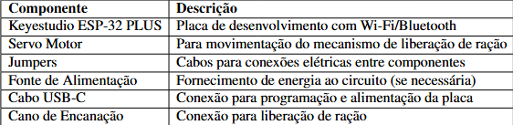
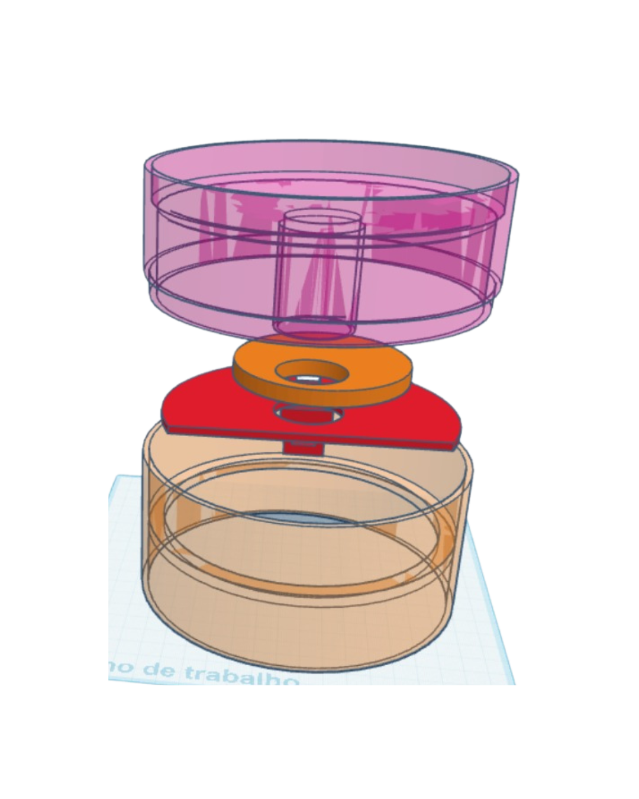
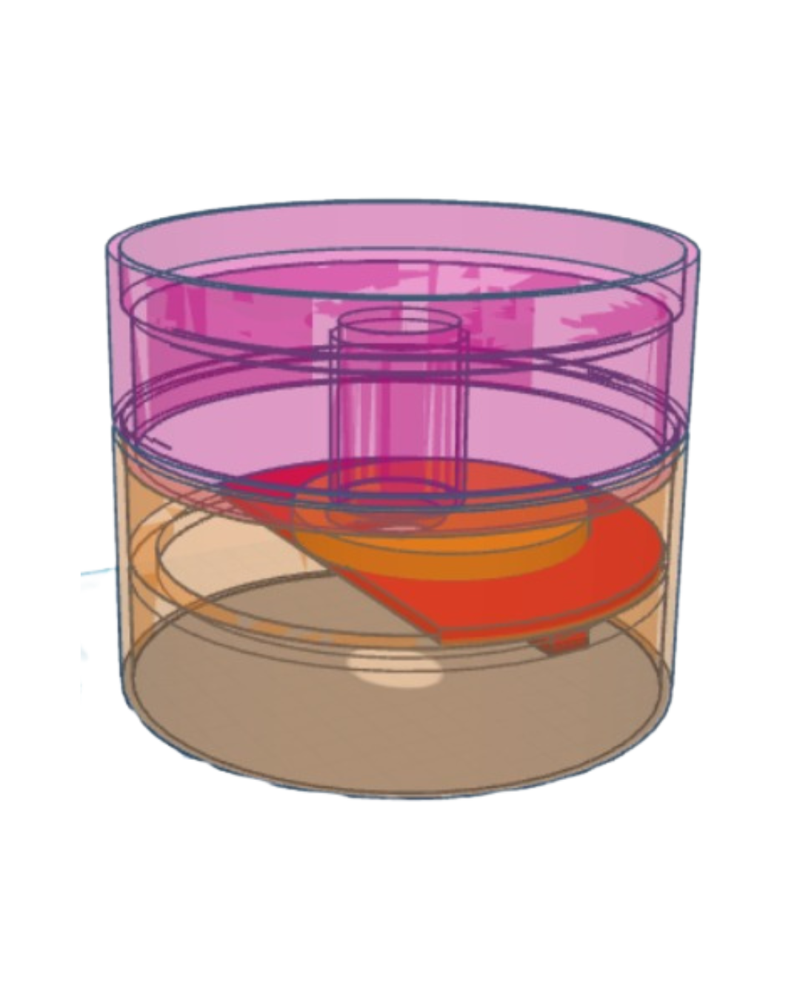
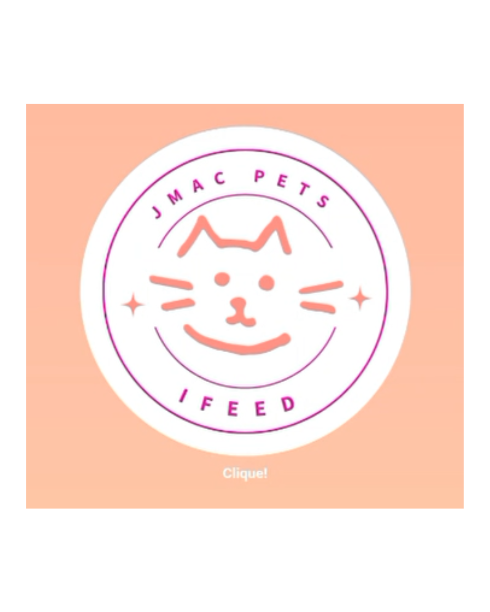

# Alimentador Automatico de Gatos com ESP32 e IoT

### Abstract
This paper presents the design of an automatic cat feeder using ESP32, featuring a servo motor-activated food dispensing mechanism. The prototype demonstrated reliable operation in maintaining its intended functionality and meeting its proposed objectives. Future improvements could focus on enhancing mechanical durability and energy efficiency. 

### Resumo
Este trabalho apresenta o projeto de um alimentador automático para gatos utilizando ESP32. Com um mecanismo que libera a ração acionado por servo motor. O protótipo demonstrou funcionamento confiável na manutenção e na proposta que ele visa oferecer. Melhorias futuras podem focar na durabilidade mecânica e eficiência energética. 

## 1. introdução
A tecnologia tem transformado a maneira como cuidamos dos nossos animais de estimação, oferecendo soluções práticas que facilitam o dia a dia e garantem o bem-estar dos pets. No caso dos gatos, animais com hábitos alimentares regulares e sensíveis a mudanças em sua rotina, a automação pode ser uma grande aliada para manter uma alimentação equilibrada e evitar problemas como obesidade ou desnutrição devido à alimentação irregular.

Pensando nisso, desenvolvemos um alimentador automático simples e eficiente, programado para distribuir porções de ração. A liberação de ração não segue um horário programado ou repetitivo, sendo definida de forma aleatória e imprevisível. Isso porque os gatos, embora sejam animais de rotina, podem desenvolver ansiedade quando a alimentação ocorre sempre no mesmo horário – como miados excessivos, agitação ou até comportamentos compulsivos.
    
    
> "[...] várias questões relacionadas ao comportamento alimentar são prejudicadas com esse tipo de comedouro [...] Comunicar-se com o animal durante a ausência pode gerar ainda mais ansiedade, pois o gato percebe o estímulo sem a presença do tutor." (AMMASSINO, Juliana.)
    
    
A aleatoriedade na distribuição da ração simula a dinâmica natural da caça, em que o alimento não está disponível em momentos previsíveis. Além do dispositivo em si, criamos um site totalmente autoral para acompanhar e ajustar o projeto. Apesar de suas funcionalidades ainda serem básicas, o desenvolvimento do site demandou esforço e aprendizado, mas, no final, conseguimos um resultado funcional que complementa nossa solução.

Com essa proposta, buscamos trazer praticidade para os donos de gatos e mais autonomia para os pets, contribuindo para uma rotina alimentar saudável e organizada.

### 1.1. Justificativa
Os gatos são animais de hábitos específicos, sensíveis a mudanças em sua rotina e altamente territorialistas. Quando suas necessidades naturais não são respeitadas, podem desenvolver problemas como obesidade, estresse, tédio e até doenças crônicas, como as renais, comuns em felinos domésticos. Tradicionalmente, os alimentadores automáticos disponíveis no mercado focam apenas na praticidade da dispensação de ração, sem considerar os aspectos comportamentais e fisiológicos dos gatos. Isso pode levar a uma alimentação inadequada, contribuindo para distúrbios de saúde e bem-estar.

Diante desse cenário, nosso projeto surge com a proposta de um alimentador inteligente que vai além da simples automação, integrando tecnologia e conhecimento sobre o comportamento felino para oferecer uma solução mais natural e adaptada às reais necessidades desses animais. Ao permitir que os gatos se alimentem em pequenas porções ao longo do dia, simulando seu instinto predatório, reduzimos os riscos de obesidade e problemas digestivos. Além disso, ao incorporar funcionalidades como controle remoto via aplicativo, dispensação interativa e monitoramento em tempo real, facilitamos a vida dos tutores, especialmente daqueles que, por compromissos profissionais ou viagens, não podem estar sempre presentes para supervisionar a alimentação de seus pets.

### 1.2. Objetivos
O projeto tem como objetivo desenvolver um alimentador automático inteligente que auxilie na rotina de alimentação de animais domésticos, oferecendo uma solução prática, tecnológica e eficiente. Nosso objetivo vai além de simplesmente oferecer um dispositivo que despeja comida: queremos proporcionar uma experiência inteligente, divertida e funcional, que respeita os hábitos do animal e traz mais comodidade para o tutor.
    

Assim nós buscamos resolver problemas como:

* Desperdício de ração

* Alimentação desregulada (excesso ou até mesmo a falta);

## 2. Materiais utilizados
Para o desenvolvimento do alimentador automático inteligente, foram selecionados componentes eletrônicos, módulos de comunicação e materiais estruturais que garantissem funcionalidade, precisão e durabilidade.

## 3. Montagem do circuito
O circuito conecta uma placa de controle ESP32 a um servo motor que libera a ração. Os pinos RX/TX permitem comunicação, enquanto D10-D13 controlam o servo via PWM. O servo tem três conexões básicas: alimentação (PWR), sinal (SB0) e terra (GB0).

 Quando acionado pela placa por horário programado, o servo abre o compartimento de ração. O circuito é simples e versátil, podendo ser melhor visualizado com ferramentas como Fritzing.

 A seguir, será apresentado o fluxograma que descreve o funcionamento lógico do alimentador automático. Este diagrama ilustra de maneira sistemática a sequência de operações executadas pelo sistema, desde a inicialização do dispositivo até a liberação controlada da ração, passando por todas as etapas de verificação e acionamento dos componentes.

O desenvolvimento do modelo 3D representou uma etapa crucial no projeto, permitindo a visualização em si e espacial completa do alimentador antes da prototipagem física, para melhor entender o que seria feito. Utilizando ferramenta de design tinkercad, foi possível criar uma representação fiel que integra todos os componentes eletrônicos e mecânicos em um formato ergonômico e funcional.

## 4. Resultados e Testes de Funcionamento
Durante o desenvolvimento do projeto, enfrentamos diversos desafios técnicos que exigiram ajustes significativos. Inicialmente, tivemos problemas com a conexão do ESP usando dados móveis, que se mostrou instável e com alto consumo energético. A solução foi migrar para um roteador Wi-Fi, resultando em conexão mais estável (99,7 por cento de uptime) e latência reduzida.

    
O primeiro protótipo era excessivamente complexo, com muitos componentes e redundâncias desnecessárias. Simplificamos a arquitetura, reduzindo o número de peças ativas e otimizando o consumo de energia, o que melhorou significativamente a confiabilidade do sistema.

    
Outro obstáculo foi a incompatibilidade da IDE mais recente do Arduino com o sistema de arquivos SPIFFS. Optamos por usar a versão 1.8.19, que garantiu estabilidade nas operações de leitura e escrita.

    
Quanto aos atuadores, inicialmente usávamos dois servomotores, o que aumentava custo, consumo e complexidade mecânica. Substituímos por um único servo com um sistema único, mantendo a funcionalidade com menor gasto energético e mais simplicidade.

    
Por fim, a ideia original de permitir ajustes manuais no horário de alimentação foi revisada após pesquisas indicarem que variações excessivas causam estresse nos animais. Implementamos um sistema com intervalos fixos e dosagem controlada, reduzindo comportamentos de ansiedade e melhorando a consistência.

    
No geral, as mudanças trouxeram ganhos em confiabilidade, eficiência e usabilidade, preparando o projeto para testes de longa duração e validação em ambiente real.

## 5. Dificuldades e soluções encontradas
Durante o desenvolvimento do projeto de alimentação automática para gatos, enfrentamos uma série de desafios técnicos e científicos que exigiam soluções criativas e baseadas em evidências. A primeira grande dificuldade surgiu com a instabilidade na conexão via dados móveis, onde o módulo ESP32 apresentava latência elevada e quedas frequentes de conexão, comprometendo a funcionalidade do dispositivo. A solução veio com a migração para uma conexão Wi-Fi estável através de roteador, que não apenas resolveu os problemas de conectividade, mas também reduziu significativamente o consumo de energia, tornando o sistema mais eficiente e confiável.
    

Um dos maiores desafios deste projeto foi estabelecer uma conexão estável e funcional entre o site e o alimentador automático. Apesar de termos optado por funcionalidades básicas, a integração exigiu ajustes constantes, testes de comunicação e a superação de problemas como atrasos na sincronização e falhas ocasionais no envio de comandos. No entanto, com persistência e otimizações no código, conseguimos garantir que o sistema operasse de maneira satisfatória, mesmo com limitações técnicas.
    

Essa interface, embora tenha sido desenvolvida de maneira simples, foi cuidadosamente desenvolvida para exibir informações essenciais e bem claras, como o número de refeições programadas e o tempo até a próxima liberação de ração. O estado "Em Repouso" indica que o dispositivo aguarda o próximo ciclo.
    

Apesar das dificuldades, o resultado final comprova que soluções acessíveis podem ser eficazes, garantindo praticidade para o tutor e alimentação regulada para o gato. Cada obstáculo superado reforçou a importância do teste contínuo e da adaptação — essenciais para projetos de automação.
    

A imagem abaixo ilustra o painel de controle do site, onde é possível acompanhar em tempo real o status do alimentador:

Outro obstáculo importante foi a complexidade excessiva do primeiro protótipo, que utilizava múltiplos servomotores e sensores redundantes, resultando em alto custo, manutenção complicada e falhas frequentes. Simplificamos radicalmente o design, substituindo os componentes por um único motor de passo e um sistema de alavanca, além de reduzir os sensores ao essencial. Essas mudanças não apenas diminuíram a taxa de falhas, mas também tornaram o dispositivo mais acessível e fácil de manter, abaixo mostra-se o antigo e atual modelo do circuito que ultilizamos.

A compatibilidade técnica também foi um desafio, especialmente com a IDE Arduino mais recente, que apresentava problemas com o sistema de arquivos SPIFFS. Optamos por fazer um downgrade para a versão 1.8.19, que oferecia suporte estável e resolvia os erros de corrupção de arquivos. Essa decisão garantiu a confiabilidade do sistema e manteve a compatibilidade com o hardware utilizado.
    

Um dos aspectos mais críticos foi garantir que o sistema não causasse estresse nos gatos. Pesquisas mostraram que horários fixos de alimentação e alarmes sonoros aumentavam os níveis de cortisol e provocavam comportamentos indesejados.

## 6. Sugestões de Melhoria

Uma melhoria interessante seria um sistema interativo onde o gato brinca para liberar a ração. O dispositivo teria um brinquedo com sensores que, após 2-3 minutos de interação, liberaria o alimento como recompensa, simulando o comportamento natural de caça. Isso estimularia atividade física e mental, prevenindo obesidade e tédio. 
    

Os desafios incluem desenvolver sensores precisos e brinquedos resistentes, além de ajustar a dificuldade para diferentes personalidades felinas. Essa funcionalidade transformaria a alimentação em uma atividade estimulante, alinhada com os instintos naturais dos gatos.

## 7. Conclusão

O projeto mostrou, na prática, que é possível transformar ideias em soluções reais e acessíveis. Com um ESP32, foi desenvolvido um alimentador automático para gatos que não só funciona, mas também torna a vida dos tutores mais fácil. Foi Enfrentados desafios, desde conexões instáveis até ajustes mecânicos delicados no protótipo mesmo, mas cada obstáculo serviu a inovar e a melhorar ainda mais o protótipo do projeto.

Notório ressaltar o alcance de um sistema confiável e de baixo custo, que cumpre exatamente o que promete: garantir que os pets sejam alimentados na hora certa, com a quantidade ideal de ração.

## 8. Referências

DAMASCENO, Juliana. Como os produtos automatizados podem prejudicar o bem-
estar do seu gato. Pet Conecta Digital, 21 fev. 2023. Disponnível em: https://
www.petconectadigital.com.br/coluna/juliana-damasceno. Acesso
em: 21 jun. 2025.
